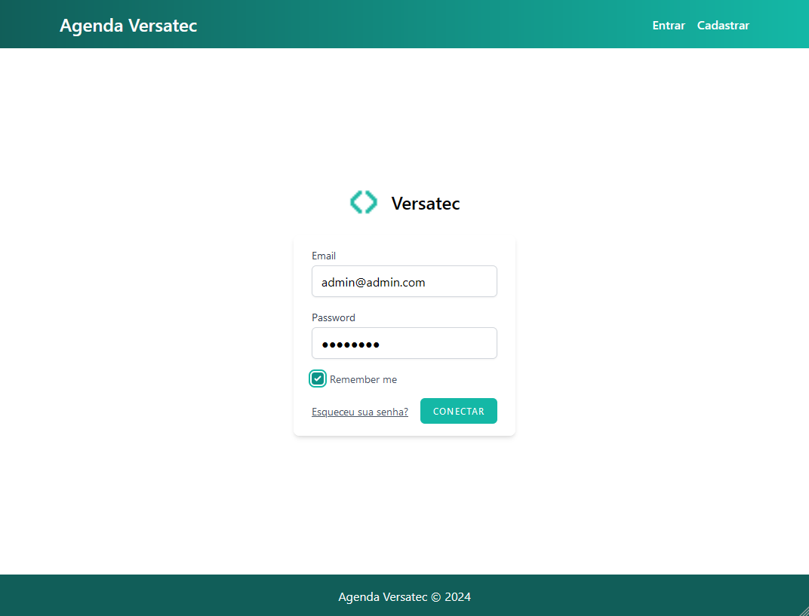
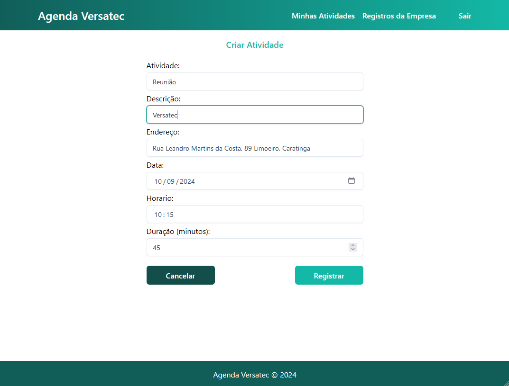

<p align="center"></p>

# Desafio Versatech Agenda
Desenvolver uma agenda utilizando as tecnologias PHP e Mysql juntamente com o Framework Laravel

## Tabela de Conteúdo

- [O Desafio](#o-desafio)
	- [Objetivo](#objetivo)
	- [Descrição](#descrição)
- [Instalação](#instalação)
	- [Dependências](#dependências)
	- [Instale Dependencias do projeto](#instale-dependencias-do-projeto)
	- [Configurando o Arquivo .env](#configurando-o-arquivo-env)
	- [Gere a Chave de Aplicação](#gere-a-chave-de-aplicação)
	- [Execute as Migrações](#execute-as-migrações)
	- [Instale as dependências do Node.js](#instale-as-dependências-do-nodejs)
	- [Inicie o Servidor de Desenvolvimento](#inicie-o-servidor-de-desenvolvimento)
- [Desenvolvimento do App](#desenvolvimento-do-app)
	- [Tecnologias](#tecnologias)
	- [MVC](#mvc)
	- [Funcionalidades](#funcionalidades)
	- [Diagrama de Entidade e Relacionamento](#diagrama-de-entidade-e-relacionamento)

# O Desafio

### Objetivo

O objetivo deste projeto é testar as habilidades diante do uso da linguagem orientada a objetos e o padrão MVC. O Framework Laravel lida com isso de uma maneira muito elegante, além de criar páginas simples e intuitivas de forma rápida e eficaz através dos arquivos blade.

### Descrição

O projeto deverá possuir uma tela de login para as devidas autenticações e assim ser um sistema multiusuário. Deverá possuir um cadastro de usuário e outro de tarefa onde o sistema não deverá permitir cadastros de tarefas no mesmo dia e horários para um mesmo usuário. Deve-se gerar nomenclaturas intuitivas das rotas para uma identificação simples das requisições. A utilização de Javascript, jquery e ajax é livre caso ache necessário.

Para o layout poderá ser utilizado o bootstrap ou qualquer outra biblioteca para facilitar na construção do designer e assim apresentar na tela as tarefas agendadas de cada usuário.

O banco de dados utilizado deverá ser o mysql sendo necessário realizar um estudo e geração de um diagrama de entidade e relacionamento para facilitar o entendimento e utilização das tabelas do banco.

O projeto deverá ser versionado com as mudanças periódicas utilizando a ferramenta Git e publicado no GitHub.

# Instalação

### Dependências
- php 8.2.0^
- Composer

### Instale Dependencias do projeto
```console
composer install
```

### Configurando o Arquivo .env

Crie uma cópia do `.env.example`
```
cp .env.example .env
```

Remova os comentários destas linhas e configure para `DB_CONNECTION=mysql`
```env
DB_CONNECTION=mysql
DB_HOST=127.0.0.1
DB_PORT=3306
DB_DATABASE=agenda
DB_USERNAME=root
DB_PASSWORD=
```

### Gere a Chave de Aplicação
```bash
php artisan key:generate
```

### Execute as Migrações
Neste momento, verifique se você tem um servidor de banco de dados MySQL em execução. Ao executar o comando a seguir, caso não exista um banco de dados chamado `agenda`, o sistema sugerirá criá-lo. Prossiga confirmando com uma resposta positiva no terminal, como `yes`.
```bash
php artisan migrate
```

### Instale as dependências do Node.js
```console
npm install
```
```console
npm run build
```

### Inicie o Servidor de Desenvolvimento
```console
php artisan serve
```
O projeto estará disponível no navegador em: http://127.0.0.1:8000.

# Desenvolvimento do App

## Tecnologias
- Laravel Framework 11.22.0
  - Jetstream + Wireframe
- PHP 8.2.0
- MySQL
- Tailwindcss
- Git e GitHub

## MVC
O desenvolvimento do projeto foi orientado ao padrão MVC.

### Model

**Model User**: Este modelo é o padrão fornecido pela aplicação Laravel, com a única modificação sendo a adição do relacionamento hasMany com o modelo Task, indicando que um User pode ter múltiplas Tasks.

**Model Task**: Este modelo foi criado inicialmente por meio de uma migration, seguida por outra que adicionou a chave estrangeira user_id, estabelecendo um relacionamento belongsTo com o modelo User. Isso indica que cada Task pertence a um único User. Os atributos presentes no modelo são:
- id()
- string('title')
- text('description')
- date('date')
- string('address')
- time('start_time')
- integer('duration_minutes')
- timestamps()
- foreignId('user_id')

### View

Para a criação dos templates da view, foi utilizado o blade.

### Controller

**Task Controller**: Este controller é o responsável por receber requisições, processá-las, interagir com o modelo (dados) e, em seguida, retornar uma resposta. Foram implementadas os seguintes métodos no Task Controller:
- **tasks_user()**: Método responsável por retornar uma view com todas atividades do usuário conectado.
- **tasks_all()**: Método responsável por retornar uma view com todas atividades registradas na app.
- **taskFormCreate()**: Método responsável por retornar uma view para registro de atividade.
- **store()**: Método responsável por armazenar no banco de dados uma nova atividade.
- **show($id)**: Método responsável por retornar uma view com detalhes de uma atividade através do id referente à atividade.

## Funcionalidades
- Login
  <p></p>
- Registro de Atividades
  <p></p>
- Listar Minhas Atividades
  <p></p>
- Listar Registro de Atividades da Empresa
  <p></p>
- Filtro de atividades por Título ou Data
  <p></p>

## Diagrama de Entidade e Relacionamento
<p></p>